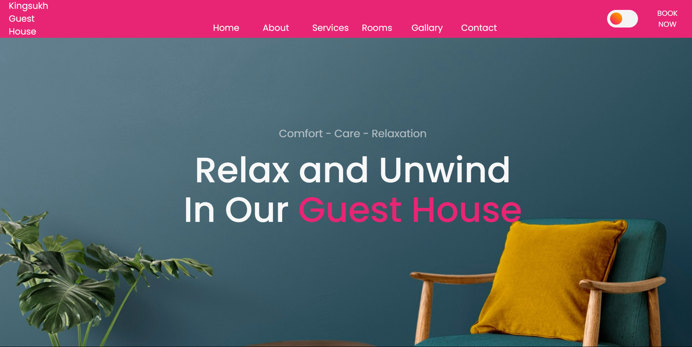
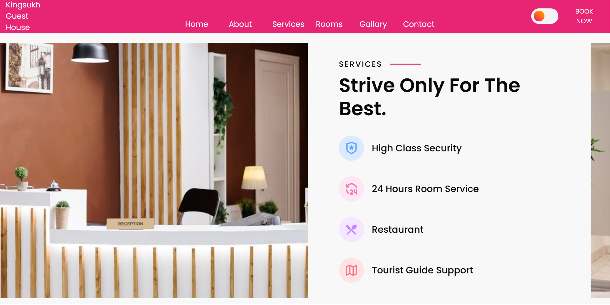
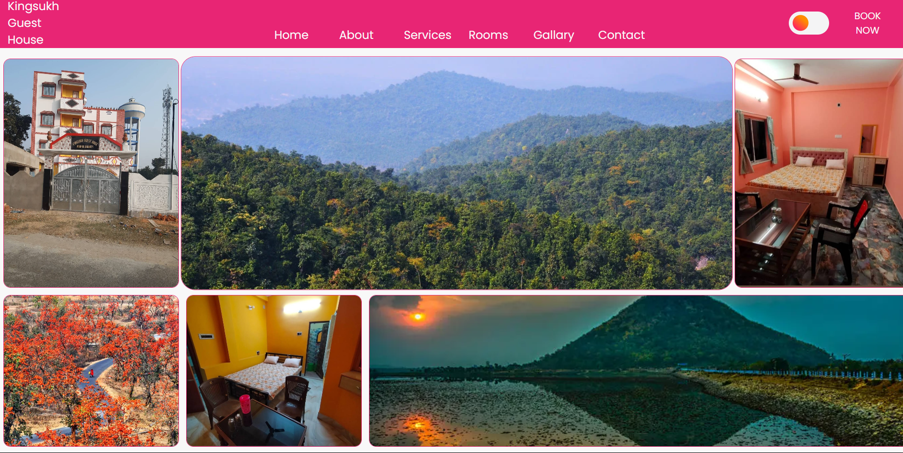

# Kingsukh Guest House - Web Project 🏡

## Purpose 🎯
The Kingsukh Guest House website is designed to provide a seamless and engaging experience for visitors seeking comfortable and scenic accommodations in Baranti, West Bengal. It features a well-structured layout with sections for Home, About, Services, Rooms, Gallery, and Contact. The Home section welcomes users with a banner emphasizing comfort and relaxation, alongside a convenient booking button. The About section offers a glimpse into the guest house's unique offerings, including its proximity to picturesque locations like Baranti Hill, Maithon Dam, and Susunia Hill, coupled with an address and contact information.

## Highlights ✨

### Well-Organized Sections 🗂️:
 - Clear division into Home, About, Rooms, Services, Gallery, and Contact sections.
 - Each section contains targeted content relevant to a guest house.

### Responsive Design Elements 📱:
 - Use of viewport meta tag ensures mobile-friendliness.
 - Layout hints like section__container suggest adaptability for smaller screens.

### Effective Call-to-Actions (CTA) 💬:
 - "Book Now" buttons are prominently placed and functional.
 - Clear redirection to WhatsApp for easy booking.

### Contact Details & Map Integration 📍:
 - Includes address, phone number, email, and a Google Map embed for location visualization.
 - The "Send a Message" form encourages user interaction.

### Visual Appeal 🎨:
 - Image-based content like gallery and room cards enhances engagement.
 - Icons (e.g., Remix Icons) add an intuitive touch to services and features.

## Features 🔑
 - The Rooms section showcases accommodations such as the Cozy Haven Room and Spacious Serenity Suite, each with detailed descriptions, pricing, and booking options.
 - The Services section highlights amenities like 24-hour room service, a restaurant, and tourist guide support.
 - The Gallery section provides visuals of the guest house, nearby attractions, and facilities, adding a vibrant appeal.
 - Website integrates responsive design principles, a theme toggle feature, and a call-to-action button for immediate bookings.

## Point 📌
 - The JavaScript code provided handles interactive and animated elements on a website. It manages a responsive navigation menu by toggling visibility when the menu button is clicked and ensuring the button icon switches between a menu and close state when navigation links are clicked.

## Result 🌟

